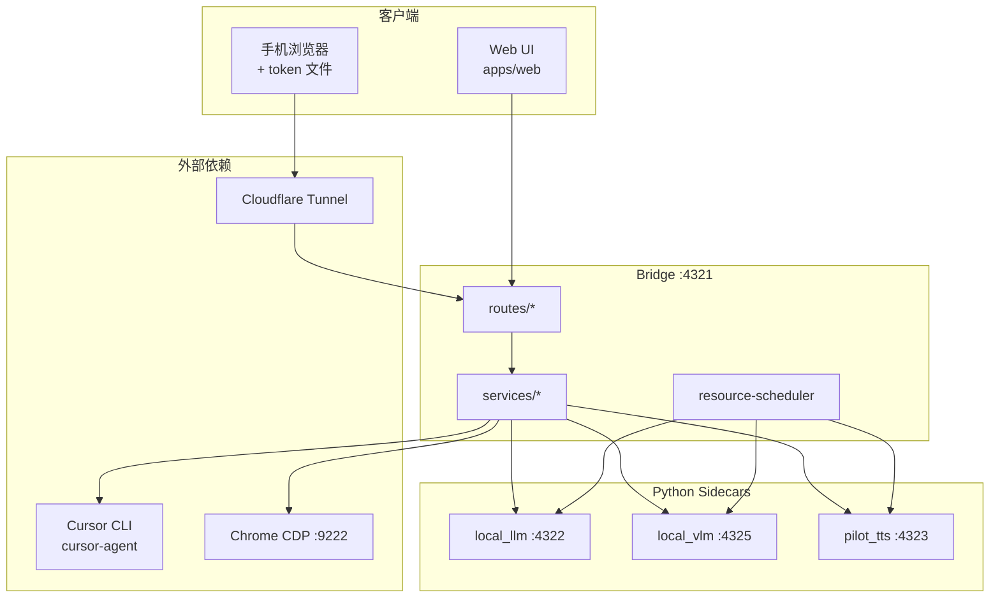

# ChattingCursor 架构概览

> 本文档描述 monorepo 整体结构、服务边界与主要数据流。  
> 分析快照日期：**2026-06-08**，分支 **`tts_upgrade`**。  
> 统计来源：CodeGraph（328 文件 / 2270 函数 / 6 种语言）。重大重构后请按 [CODEGRAPH_OVERVIEW.md](./CODEGRAPH_OVERVIEW.md) 重新生成。

## 产品定位

ChattingCursor 是一套 **本地优先** 的聊天界面：Web 前端可部署到 GitHub Pages，**Bridge** API 常驻本机，通过 **Cursor CLI**（`cursor-agent`）驱动对话。可选能力包括本地 GGUF 推理、视觉模型、PilotTTS 朗读、知识库、Chrome 联网搜索，以及 Cloudflare Quick Tunnel 供手机远程访问。

## Monorepo 结构

```
ChattingCursor/
├── apps/
│   ├── bridge/          # Fastify API 网关（TypeScript）
│   └── web/             # Vite + React 前端
├── packages/
│   ├── cli-client/      # Cursor CLI 封装与流式解析
│   └── shared/          # Zod schema、共享类型与工具
├── local_llm/           # 离线 LLM sidecar（Python FastAPI）
├── local_vlm/           # 离线 VLM sidecar（Python FastAPI）
├── pilot_tts/           # PilotTTS 朗读 sidecar + 上游依赖
├── scripts/             # 安装、启动、质量检查脚本
└── docs/                # 运维与架构文档
```

| 包 / 目录 | 职责 | CodeGraph 规模（2026-06-08） |
|-----------|------|------------------------------|
| `apps/bridge/src` | HTTP API、进程生命周期、资源调度 | 102 文件，733 函数，38 类 |
| `apps/web/src` | React UI、Bridge 客户端 | 34 文件，368 函数，23 类 |
| `packages/shared` | 跨端契约与排序/错误分类 | 9 文件，38 函数 |
| `packages/cli-client` | 调用 `cursor-agent`、解析 NDJSON 流 | 3 文件，28 函数 |
| `local_llm/server` | OpenAI 兼容本地聊天 API | 4 文件，52 函数 |
| `local_vlm/server` | 视觉嵌入 / 加载 API | 1 文件，10 函数 |
| `pilot_tts/server` | TTS 合成 API（项目自有入口） | 1 文件，12 函数 |
| `pilot_tts/upstream` | 上游 PilotTTS / CosyVoice（第三方） | 152 文件，907 函数 |

**循环依赖：** CodeGraph 未检测到模块级循环依赖。

## 运行时服务与端口

| 服务 | 默认端口 | 环境变量 | 说明 |
|------|----------|----------|------|
| Bridge | `4321` | `BRIDGE_PORT`, `BRIDGE_HOST` | 主 API；`apps/bridge/src/index.ts` |
| Offline LLM | `4322` | — | `local_llm/server/llm_server.py` |
| PilotTTS API | `4323` | `PILOT_TTS_PORT` | `pilot_tts/server/tts_server.py` |
| PilotTTS WebUI | `8090` | `PILOT_TTS_WEBUI_PORT` | 可选 Gradio 测试/调试配置界面 |
| Offline VLM | `4325` | — | `local_vlm/server/vlm_server.py` |
| Web 开发服 | `43210` | Vite `base: /ChattingCursor/` | `apps/web` |
| Chrome CDP（可选） | `9222` | — | `/websearch` 免费 Google 搜索 |

启动入口：`run.bat`（Windows）或 `scripts/run-all.sh`；首次安装见 `install.bat` / `scripts/install-all.*`。

## 逻辑架构



## Bridge 路由分组

Bridge 在 `index.ts` 注册以下路由模块：

| 模块 | 前缀 / 路径示例 | 职责 |
|------|-----------------|------|
| `auth` | `/auth/status`, `/auth/verify` | 远程访问 token 校验 |
| `chat` | `/chat/send`, `/chat/stream/:runId` | 会话、流式输出、图片上传与分析 |
| `local` | `/local/config`, `/local/token-file` | 本机配置、历史、隧道、调度设置 |
| `knowledge` | `/knowledge/tree`, `/knowledge/nodes` | 本地知识库 CRUD |
| `offline` | `/offline/status`, `/offline/warmup` | 离线栈状态与预热 |
| `local-llm` | `/local-llm/installed`, `/local-llm/install` | GGUF 模型安装与管理 |
| `local-vlm` | `/local-vlm/installed`, `/local-vlm/settings` | 视觉模型安装与设置 |
| `tts` | `/tts/start`, `/tts/synthesize` | PilotTTS 生命周期与合成 |

健康检查：`GET /health` 聚合 CLI、Chrome、本地 LLM 与资源调度器快照。

## 核心数据流

### 1. 聊天（Cursor CLI）

1. Web `POST /chat/send` → Bridge `scheduleCursorCliRun`（`routes/chat.ts`）
2. `packages/cli-client` 启动 `cursor-agent`，NDJSON 流写入 active run
3. 客户端 `GET /chat/stream/:runId` SSE 拉取增量文本
4. 可选：`/websearch` 触发 Chrome Google 搜索 + CLI 摘要（`chrome-google-search.ts`）

### 2. 离线 LLM / VLM

1. Web 在「本地 → 模型」触发安装 / 加载
2. Bridge `local-llm-lifecycle` / `local-vlm-lifecycle` 拉起 Python sidecar
3. `resource-scheduler` 协调 GPU/内存，避免 LLM、VLM、TTS 同时占满显存
4. 推理请求经 Bridge 代理到 sidecar 的 OpenAI 兼容端点

### 3. PilotTTS 朗读

1. Web `TtsSubPage` / `useSpeech` → Bridge `/tts/*`
2. Bridge `pilot-tts-lifecycle` / `pilot-tts-spawn.ts` 拉起 `server/tts_server.py`（`:4323`，生产路径）
3. 合成请求转发至 sidecar（`POST /tts/synthesize` → `POST /v1/synthesize`）
4. 可选 WebUI（测试/调试）：`POST /tts/webui/start` → `upstream/webui.py` Gradio `:8090`
5. 独立测试：`pilot_tts/run.bat` 默认启动 WebUI `:8090`；`run.bat api` 仅用于手动验证 `:4323`（非应用自动调用）

### 4. 远程手机访问

1. `run.bat` 启动 Cloudflare Quick Tunnel，更新 `publicBridgeUrl`
2. Bridge 写入 token 文件（默认 `%USERPROFILE%\.chattingcursor\chattingcursor-token.txt`）
3. 手机浏览器携带当日 token 访问隧道 URL → `requireRemoteToken` 中间件

## 复杂度热点（维护时注意）

CodeGraph 识别的主要复杂函数：

**Bridge (`apps/bridge/src`)**

| 函数 | 文件 | 复杂度 |
|------|------|--------|
| `openGoogleSearchInChrome` | `services/chrome-google-search.ts` | 43 |
| `buildPartialWebSearchResult` | `services/chrome-google-search.ts` | 25 |
| `getLocalLlmHealthStatus` | `services/local-llm-lifecycle.ts` | 21 |

**Web (`apps/web/src`)**

| 组件 / 函数 | 文件 | 复杂度 |
|-------------|------|--------|
| `ConfigSubPage` | `components/ConfigSubPage.tsx` | 52 |
| `TtsSubPage` | `components/TtsSubPage.tsx` | 52 |
| `ChatPanel` | `components/ChatPanel.tsx` | 35 |

**PilotTTS 自有服务**（`pilot_tts/server`）：`synthesize`(9)、`health`(8)、`load_gpu_engine`(7)。上游 CosyVoice/Matcha 训练代码复杂度更高，日常 ChattingCursor 集成以 `server/` 为准。

## 调用热路径（跨模块）

被调用次数最多的符号（节选）：

| 函数 | 位置 | 说明 |
|------|------|------|
| `readErrorDetail` | `apps/web/src/api/bridge.ts` | 统一 Bridge 错误解析 |
| `buildAuthHeaders` | `apps/web/src/api/bridge.ts` | 鉴权头构建 |
| `getRepoRootDir` | `apps/bridge/src/paths.ts` | 仓库根路径解析 |
| `getChattingCursorHomeDir` | `apps/bridge/src/paths.ts` | 用户数据目录 |
| `resolveLocalLlmApiBaseUrl` | `services/local-llm-lifecycle.ts` | LLM sidecar 地址 |

## 分支 `tts_upgrade` 变更摘要（相对 `main`）

CodeGraph PR 分析（2026-06-08）：

- **116 个文件**变更（+8082 / −1429 行）
- 风险评级：**低**
- 主要影响面：TTS 路由与服务、资源调度器、离线 VLM、Web 语音子页
- 测试覆盖缺口：依赖锁文件变更未关联单元测试

详细 PR 上下文见 [CODEGRAPH_OVERVIEW.md](./CODEGRAPH_OVERVIEW.md#分支-pr-上下文)。

## 相关文档

- [README.md](../README.md) — 端口表与快速运行
- [QUICKSTART.md](./QUICKSTART.md) — 逐步安装
- [pilot_tts/README.md](../pilot_tts/README.md) — TTS 安装与依赖说明
- [CODEGRAPH_OVERVIEW.md](./CODEGRAPH_OVERVIEW.md) — CodeGraph 使用与再生成流程
